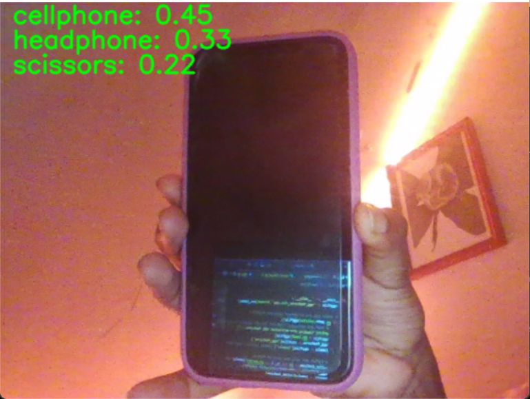

# Introduction

# Implementation
## Task 1
Task 1 is implemented by making changes to the method `classify_svm(img)` in `task 1-3.py`. The classes in clf are filtered to 
only include `my_object_list = ['headphone','cellphone','scissors']`. In order to obtain the 3 predictions for each image, I 
utilize the function `decision_function()` in `sklearn.svm.SVC`. The classify_svm(img) function I implemented works in the 
following steps:
1. Features are extracted from the image using extract_vgg_features
2. Those features are used to obtain decision scores for the classes in clf. We sort those scores in reverse order to get the highest score at the top of the list
3. We display those three predictions on the image

```python
def classify_svm(img):
    features = extract_vgg_features(img) # (1, 4096)
    decision_scores = clf.decision_function(features) # (1, 3)    
    top3_indices = np.argsort(decision_scores[0])[-3:]
    
    # Display top 3 predictions on the image
    font = cv2.FONT_HERSHEY_SIMPLEX
    for i, index in enumerate(reversed(top3_indices)):  # Reverse to show in order
        cv2.putText(img, f"{clf.classes_[index]}: {decision_scores[0][index]}", (15, 25 + i*30), font, 1, (0, 255, 0), 2, cv2.LINE_AA)
    return img
```

## Task 2
Task 2 is implemented simply by running six different configurations of the level of the CNN codes and SVM kernel, and testing
it on 3 images each (camera, headphones, and scissors). The results are displayed and discussed below.

## Task 3
Task 3 is implemented by expanding `my_object_list` to include 7 elements in addition to the already 3 elements there. We run
the SVM with linear kernel and fc1, since that was concluded to be the best configuration from Task 2.

## Task 4
In creating and training my own Convolutional Neural Network, I utilized the already provided LeNet. I attempted to enhance it 
by adding more convolutional layers or fully connected layers, but found that that only hurt its performance. I wrote 
`train_model()` to train the LeNet model provided and visualize its results. The result of that training is provided below. 
To improve accuracy, I trained the model for 100 epochs

# Results
## Task 1
Below are the output images for the top 3 predicted classes.




## Task 2
Support Vector Machines (SVMs) have the ability to use different kernel functions to define different separations of the data.
The most commonly used SVM kernels are linear, polynomial (poly), and Radial Basis Function (RBF). 
* Linear Kernel: The decision boundary between the classes is a straight line (or a hyperplane in higher dimensions), and it is used when the data is linearly separable (it can be separated into classes using a straight line.)
* Poly Kernel: Allows for non-linear decision boundaries. Higher degrees can capture more complex relationships but may also lead to overfitting. The polynomial kernel is particularly useful when the relationship between features is not linear.
* RBF Kernel: The RBF kernel can handle the case when the relationship between class labels and attributes is nonlinear. It's powerful for creating complex decision boundaries

This task evaluates six different configurations of kernel type and CNN codes level. Each kernel type is matched with fc1 and 
fc2. Being one layer closer to the input than fc2, the fc1 layer might capture a mix of higher-level features than the 
convolutional layers but still maintain a level of generality. Positioned after fc1, the fc2 layer captures features that are 
even more abstract and more closely tied to the final classification task the network was trained on. The fc2 features might 
be more discriminative for the specific classes the network can recognize.

Below are some of the output for those configurations for the headphone input image

|              | linear | poly | rbf|
|--------------|-----------------|-----------------|-------|
| **fc1** || ||
| **fc2** ||||

### Observations
In general, configurations utilizing features extracted from the fc1 layer generally outperformed those that used fc2. This 
observation suggests that fc1 is more effective for our specific dataset and task, likely because fc1 captures higher-level 
features that are less specialized than those in fc2.

Regarding the kernel types, the linear kernel emerged as the most suitable for our data. This indicates that the relationship 
between the features and the target classes in our dataset could be well-approximated using a linear decision boundary. In 
contrast, the RBF kernel produced identical class scores for each input image, which could indicate that the RBF kernel's 
complexity does not match the distribution of our data well, potentially leading to an underfitting scenario where the model 
fails to capture the underlying patterns.

The poly kernel yielded lower correct classification scores compared to the linear kernel. Furthermore, the poly kernel 
appeared to be more sensitive to variations in the input video streams. This sensitivity might stem from the Poly kernel's 
inherent property of mapping input features into a higher-dimensional space, where the presence of noise or slight variations 
in the input data can lead to substantial differences in the classification output. Unlike the Poly kernel, the RBF kernel's 
performance did not vary with changes in the input, which again might point to a mismatch between the kernel's capacity to model
complex, non-linear relationships and the actual distribution of our dataset.

The best configuration for our dataset and task is the SVM with a linear kernel, using features extracted from the fc1 layer. This
configuration works best because it strikes an optimal balance between complexity and generalization capability. Its combination of
linear decision-making and higher-level feature extraction aligns well with the characteristics of our dataset, likely indicating 
that the patterns distinguishing between our target classes can be captured through linear relationships in the space of high-level 
features provided by fc1.

## Task 3
After training the SVM with linear kernel and fc1 on an extended dataset, the solution still performs well. The correct classes are 
still included in the top predicted scores. For headphones and scissors, the correct class is predicted as to top score, and cellphone
is third in its image. The ability of fc1 features to remain effective after the dataset is extended suggests that these features 
capture the underlying patterns and distinctions between classes in a way that is not heavily dependent on the specific composition of 
the initial dataset. It indicates that the features are robust to variations and nuances introduced by new data.


## Task 4
The graph below for training and validation accuracy show that the model learned the data sufficiently without overfitting.


We arrived at an accuracy of 73.94%, and a validation accuracy of about 60%
