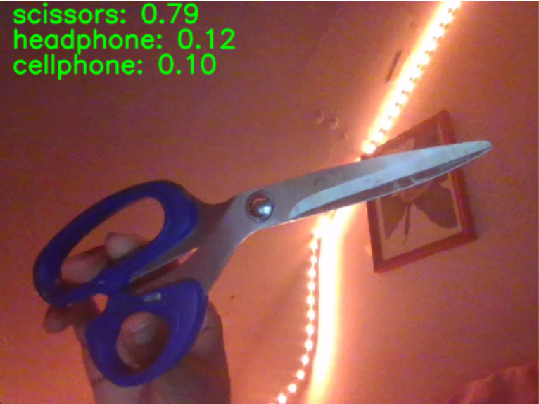
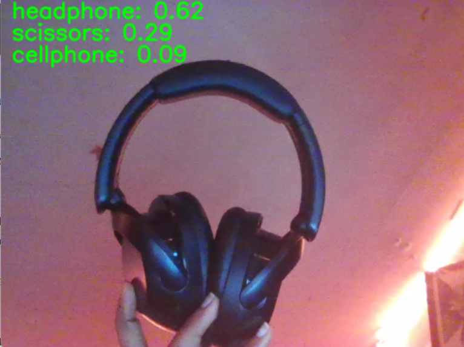

# Introduction

# Implementation
## Task 1
Task 1 is implemented by making changes to the method `classify_svm(img)` in `task 1-3.py`. The classes in clf are filtered to 
only include `my_object_list = ['headphone','cellphone','scissors']`. In order to obtain the 3 predictions for each image, I 
utilize the function `decision_function()` in `sklearn.svm.SVC`. The classify_svm(img) function I implemented works in the 
following steps:
1. Features are extracted from the image using extract_vgg_features
2. Those features are used to obtain decision scores for the classes in clf. We sort those scores in reverse order to get the highest score at the top of the list
3. We display those three predictions on the image

```python
def classify_svm(img):
    features = extract_vgg_features(img) # (1, 4096)
    decision_scores = clf.decision_function(features) # (1, 3)    
    top3_indices = np.argsort(decision_scores[0])[-3:]
    
    # Display top 3 predictions on the image
    font = cv2.FONT_HERSHEY_SIMPLEX
    for i, index in enumerate(reversed(top3_indices)):  # Reverse to show in order
        cv2.putText(img, f"{clf.classes_[index]}: {decision_scores[0][index]}", (15, 25 + i*30), font, 1, (0, 255, 0), 2, cv2.LINE_AA)
    return img
```
## Task 2
Task 2 is implemented simply by running six different configurations of the level of the CNN codes and SVM kernel, and testing it on 3 images each (camera, headphones, and scissors). The results are displayed and discussed below.

# Results
## Task 1
Below are the output images for the top 3 predicted classes.





## Task 2
Define linear, poly, and rbf. also describe fc1 and fc2 and the differences between the configurations. 
|              | linear | poly | rbf|
|--------------|-----------------|-----------------|-------|
| **fc1** || ||
| **fc2** ||||

Explanation of figures

Which configuration is the best? How would you explain why this selected configuration works best?


